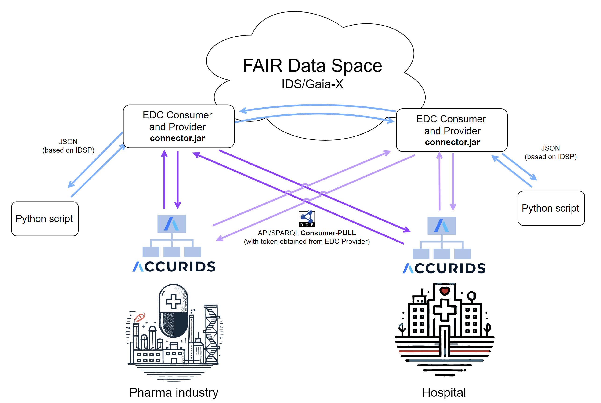

# ACCURIDS Demonstrator

The demonstrator makes use of the ACCURIDS FAIR data registry. 

We demonstrate data exchange between industry and an organization. 

For example, exchange of information related to clinical studies between a hospital and a pharmaceutical company.

The diagram below represents the use case of the demonstrator with two ACCURIDS instances, both acting as consumers and providers of information.

## The ACCURIDS platform

<a href="https://www.accurids.com" target="_blank"> www.accurids.com</a>

ACCURIDS is a platform for centralized data governance with a FAIR data registry.

It enables users to uniquely identify their data objects across systems and processes at enterprise and industry scale.

ACCURIDS offers six core features:

**Ontology**
   - Reusing standard industry ontologies through ACCURIDS Hub
   - Creation of specific ontologies for business needs

**Reference and Master Data**
   - Managing reference and master data aligned to ontology definitions 

**Data Registry**
   - Governance of data objects managed in many different systems through a centralized registration process
   - Management of data object identities

**Graph**
   - Connect data from different sources in knowledge graphs to enable question answering and analytics

**Quality**
   - Define and monitor data quality rules for different types of data objects

**AI**
   - Ask business questions in natural language and get answers based on facts from the knowledge graph

