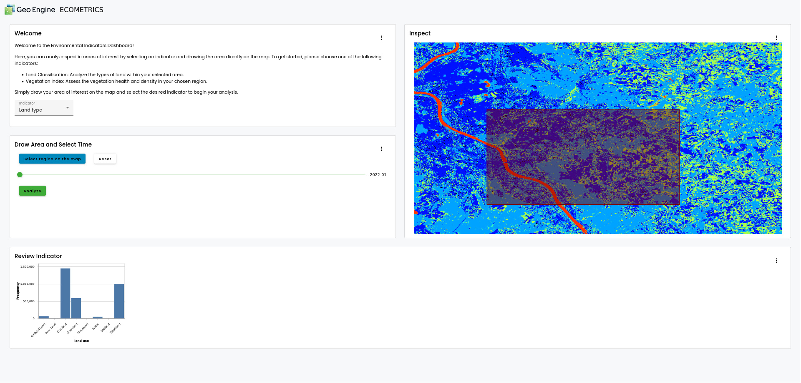

# Geo Engine Demonstrator

The Geo Engine FAIR-DS demonstrator realizes multiple use cases that show the capabilities of the NFDI data spaces and address important societal issues like the loss of biodiversity and climate change.
Within the FAIR-DS project, the Geo Engine software is extended with FAIR data services and data spaces capabilities.
New dashboards and visualizations are developed to demonstrate added-value from the FAIR-DS integration.

## Overview of the Geo Engine Platform

Geo Engine is a cloud-ready geo-spatial data processing platform.
It consists of the backend and several frontends.
The backend is subdivided into three subcomponents: services, operators, and data types.
`Data types` specify primitives like feature collections for vector or gridded raster data.
The `Operators` block contains the processing engine and operators.
The `Services` block contains data management and APIs.
It also contains the external data connectors, that allow accessing data from external sources.
Here, the connection to the data spaces is established.

Frontends for the Geo Engine are `geoengine-ui` for building web applications on top of Geo Engine.
`geoengine-python` offers a Python library that can be used in Jupyter Notebooks.
3rd party applications like QGIS can access Geo Engine via its OGC interfaces.

All components of Geo Engine are fully containerized and Docker-ready.
A GAIA-X-compatible self-description of the service is available.
Geo Engine builds upon several technologies, including GDAL, arrow, Angular, and OpenLayers.

### Aruna Data Connector

The `ArunaDataProvider` implements the Geo Engine data provider interface.
It uses the Aruna RPC API to browse, find and access data from the NFDI4Biodiversity data space using the Aruna data storage system.
By performing the translation between the Aruna API and the Geo Engine API, the connector allows to use data from the NFDI4Biodiversity data space in the Geo Engine platform.
This makes it possible to integrate the data easily into new analyses and dashboards.

### Copernicus Data Space Ecosystem

To show cross data space capabilities and to generate insightful results, the Geo Engine demonstrator is connected to the Copernicus Data Space.
It uses the SpatioTemporal Asset Catalog (STAC) API and an S3 endpoint to generate the necessary meta data to access Sentinel data.
Users can then access the Sentinel data as proper data sets and time series, rather than just as individual satellite images.
This enables temporal analysis and the generation of time series data products.

### Machine Learning Pipeline

The Demonstrator leverages Geo Engine's machine learning pipeline.
It allows streaming data from the Geo Engine to Python and train a model.
The model can then be uploaded and registered in the backend and then used as an operator to predict new and unseen data.

## ECOMETRICS Dashboard

The ECOMETRICS dashboard is a custom app developed for FAIR-DS.
It allows the user to visualize and analyze an ecological indicator, like vegetation or land use.
The demonstrator consists of two parts.
The UI is the user facing part of the application while the indicator generation happens on the backend.

### UI (Dashboard)

As visible in the screenshot, the ECOMETRICS app consists of four components.
The top left explains how the app works and lets the user select the ecological indicator.
Upon selection, the indicator will be visualized on the map on the right.
The user can then select a region of interest by drawing on the map and selecting a point in time on a slider.
The region will be intersected with the indicator.
Finally, the user can review the results in the bottom-most section of the app on a plot.
In case of a continuous indicator like vegetation, the plot will show a histogram.
In case of a classification indicator like land use, the plot will show a class histogram.

### Indicator generation

An indicator for the ECOMETRICS app is a raster time-series that is either continuous or a classification.
Currently, there are two indicator available: NDVI and land use.
Both indicators are built from Sentinel data.
The NDVI, short for Normalized Difference Vegetation Index, is computed by aggregating all Sentinel tiles for a given year and by computing `(A-B)/(A+B)` where A is the near infrared channel and B is the red channel.
The necessary data is provided by Geo Engine's Copernicus Data Space Ecosystem Connector.

#### Machine Learning

The land use indicator is created by training a machine learning model.
The training process incorporates the Sentinel data and uses the land use and land cover survey (LUCAS) as ground truth.
While the Sentinel data are again retrieved from the Copernicus Data Space, the LUCAS data are used via the Aruna data connector.
In principle, any data accessible using the Aruna data connector can be used for machine learning with Geo Engine.

The model is trained in a Jupyter notebook that defines a Geo Engine workflow, feeds the resulting data into a machine learning framework, trains the model, and registers it with the Geo Engine.
The workflow applies feature engineering on the data and re-arranges it via timeshift operations
This gives the classifier the temporal development for each training pixel at once, and allows learning the different land usage types.

## ESG Indicator and Virtual Data Trustees

Coming soon.
