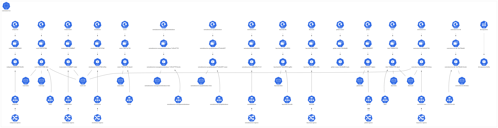
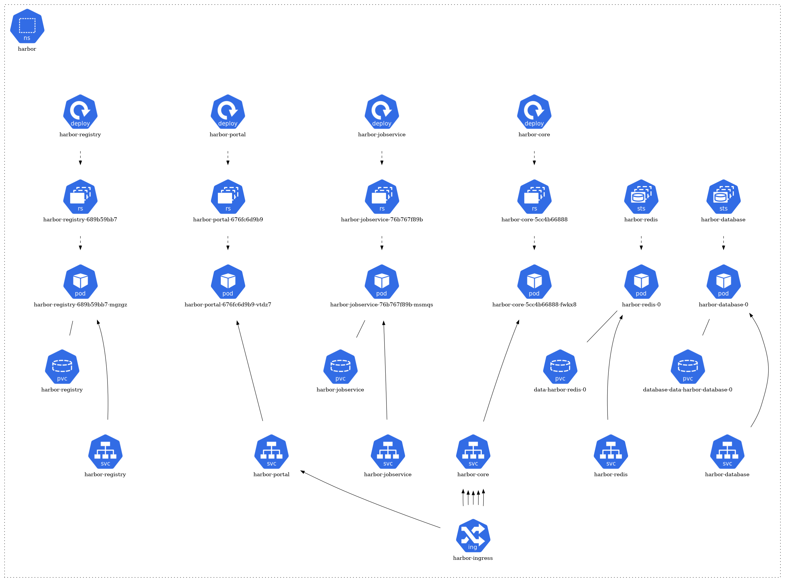
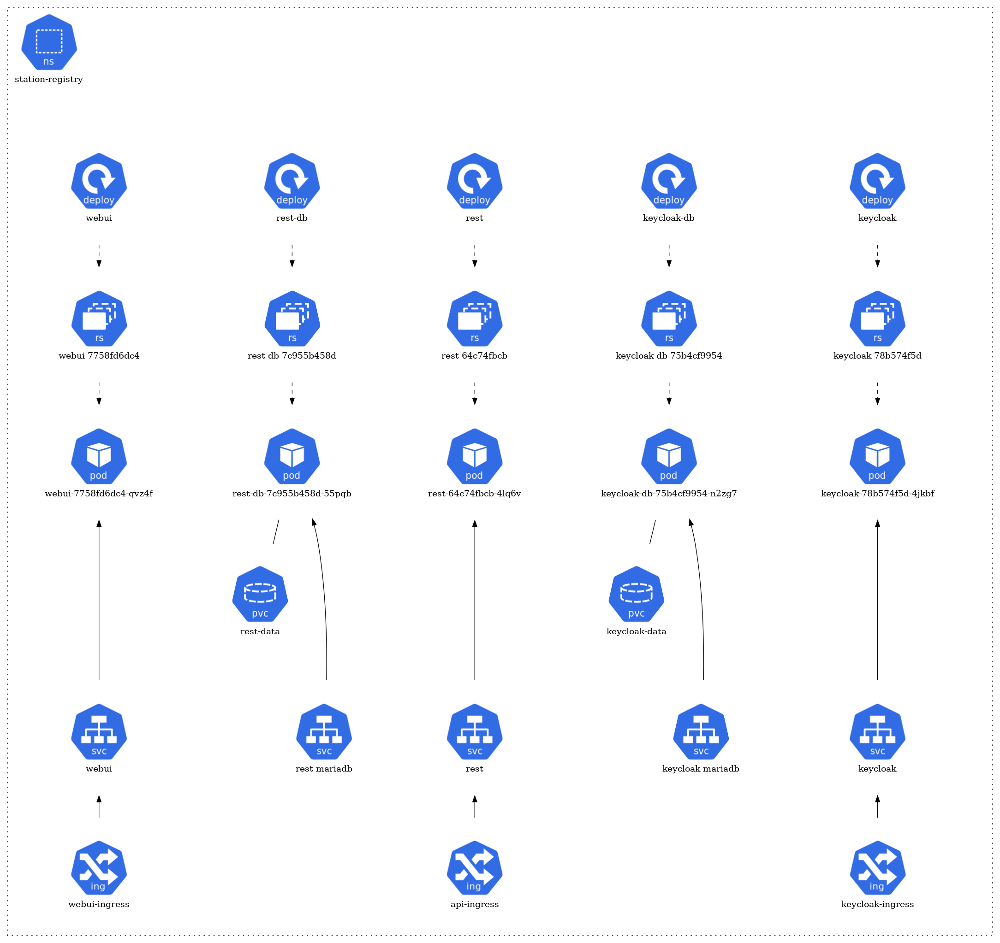
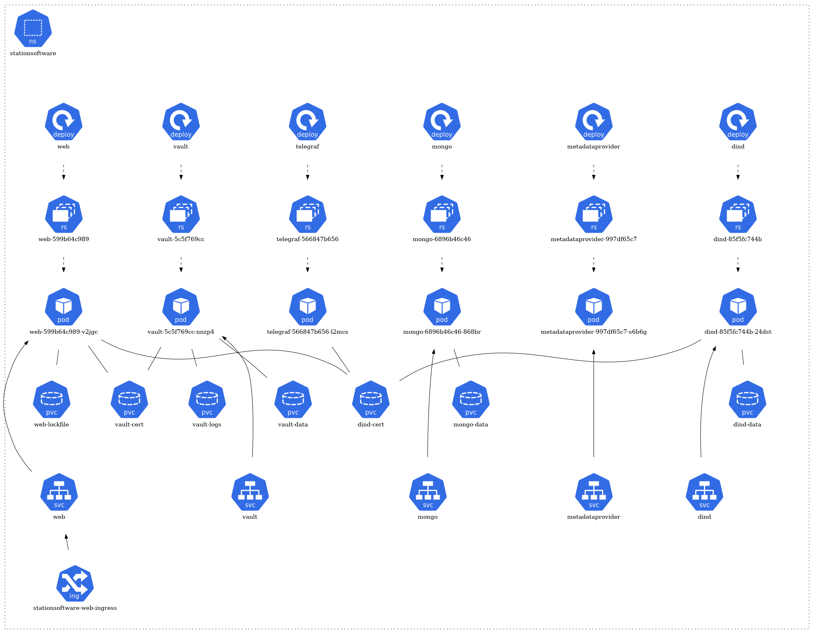

# Distributed Analytics Platform Demonstrator

## Overview of the PADME Ecosystem

This section provides a top-level view of PADME and its context.  
Further information can be found [here](https://docs.padme-analytics.de).

### Introduction
In healthcare environments, such as hospitals or medical centers, a large amount of data is collected describing symptoms, diagnoses, and various aspects of the patient’s treatment process. This data is typically reused for reviewing and comparing the patient’s condition during subsequent visits. Sometimes, selected data is shared for continued patient care when the patient moves to another hospital.

Healthcare data is also a fundamental source for medical research. The results of studies often depend on the amount of available patient data. Typically, the more data available for analysis, the more reliable the results. However, the reuse of patient data across different institutions is limited due to ethical, legal, and privacy regulations. Such restrictions are governed by laws like the [General Data Protection Regulation (GDPR)](https://gdpr-info.eu/) in Europe, the [Health Insurance Portability and Accountability Act (HIPAA)](https://www.hhs.gov/hipaa) in the U.S., or the [Data Protection Act (DPA)](https://www.gov.uk/data-protection) in the U.K.

These limitations have prompted the development of distributed analytics (DA) solutions that bring algorithms to the data, ensuring sensitive data never leaves its source and that data owners maintain control. This paradigm shift helps comply with privacy laws and regulations.

Our DA infrastructure is based on the Personal Health Train (PHT) paradigm, with privacy-enhancing features that ensure transparency and preserve privacy.

## Background
In recent years, several emerging technologies have enabled privacy-preserving data analysis. The two main paradigms of DA are **parallel** and **non-parallel** approaches. 

- **Parallel DA** sends analysis replicas to data providers and uses protocols like Federated Learning (FL) to train data models.
- **Non-parallel DA** transmits intermediate results between data providers, incrementally updating the results before returning them to the requester.

Our infrastructure leverages the PHT paradigm and incorporates novel features for containerized analysis, flexible execution environments, and transparent monitoring.

There are several methodologies based on these abstract principles:

- **Federated Learning (FL)**: FL is an approach where a central server aggregates results from multiple distributed data providers. Instead of collecting data in a central location, FL allows models to be trained across decentralized datasets. This is particularly useful in scenarios where data privacy and security are critical.
- **Incremental Learning**: This approach is used when data needs to be processed in a specific sequence or when the output of one data provider becomes the input for the next. In machine learning, this involves updating a model incrementally as unseen data becomes available as analysis moves from one data provider to another. This means that a model is trained or updated at each data provider along the route.

These concepts offer varying degrees of flexibility and complexity, and our PHT-based DA infrastructure focuses on ease of integration, compliance with privacy regulations, and extendibility.

## Architectural Overview
The PHT originates from an analogy to a railway system, where Trains represent analysis tasks, Stations host confidential data, and a Central Service (CS) coordinates the tasks. 

- **Trains** encapsulate analytic tasks, moving between stations to consume data. The tasks are executed in containers, making them self-sufficient and independent of the underlying environment.
- **Stations** hold confidential data and execute analytic tasks securely, under the control of station administrators.
- **Central Services (CS)** manage train orchestration, results storage, and security policies.

### Trains
Trains represent individual analytic tasks, moving between stations to collect data. They are containerized in Docker images, ensuring independence from the environment. The results are processed incrementally and can include various types of data, such as aggregated cohort sizes or statistical model updates.

Trains are executed in Docker-in-Docker (DinD) containers, and their lifecycle is managed via a clear state chart. Researchers can inspect the train’s progress and outcomes at different stages.

### Stations
Stations are data nodes that hold sensitive data. They are autonomous, and administrators control which analytic tasks are accepted and executed. The station software executes containerized algorithms and ensures only privacy-compliant results are transmitted back to the requester.

### Central Services
The CS handles train management, repository storage, and user access. It stores analytic algorithms and distributes them to stations. The CS also acts as a semi-trusted entity, handling intermediate results and ensuring security during train routing.

### Monitoring Components
In addition to the core operational functionality of the infrastructure (e.g., train management), we address the growing challenge of transparency as the number of participating stations increases. Without visibility into the processes, stakeholders may lose trust in the system.

To enhance transparency, we developed a novel metadata schema based on RDF(S), which enriches every digital asset with detailed semantics, such as metadata about station owners, datasets, and dynamic train execution information (e.g., current state, CPU usage). 

The **Metadata Processing Unit** at each station collects and transmits this information to a central metadata store in the Central Service (CS). This metadata is then visualized for the train requester via a **Grafana** frontend (WIP), offering insights into the train's progress.

To maintain the autonomy of stations, a customizable filter allows administrators to control what metadata is shared. This feature ensures that legal requirements are respected while providing essential transparency to users. The metadata-driven transparency enhances trust, allowing both station administrators and train requesters to monitor the status and results of analysis tasks without exposing sensitive data.

## EDC Integration Overview

The integration of Eclipse Data Components (EDC) within the PADME framework has been explored in this project. This integration aims to facilitate efficient and compliant data sharing and management. EDC provides a framework that supports secure and controlled data access.

### What is Eclipse Data Components (EDC)?
EDC is an open-source framework designed to simplify data integration, management, and sharing in distributed environments. It employs connectors that enable seamless interaction with various data sources such as databases, APIs, and file systems. EDC aims to establish a standard for interoperability among data providers and consumers, ensuring that data can be accessed, shared, and analyzed while maintaining strict adherence to privacy regulations.

### Key Features of EDC Integration
- **Flexible Data Access**: The integration supports two primary data transfer modes: **Provider Push** and **Consumer Pull**. This flexibility allows data providers to choose the most appropriate method for sharing their data based on their operational capabilities and the needs of the data consumers.

- **Interoperability**: EDC connectors enable communication between different systems, enhancing collaboration among various research institutions and organizations. This interoperability allows for creating larger datasets for analysis and improving research outcomes.

### Data Transfer Modes
EDC facilitates two distinct modes for data transfer, each catering to different use cases and operational requirements:

1. **Provider Push**:
    - In this mode, the EDC connector fetches data from its backend systems and pushes it to the consumer's designated data sink. This method is particularly useful for batch processing scenarios where data can be transmitted in one go.
    - **Benefits**:
      - Ensures timely data delivery from the provider's backend.
      - Reduces the complexity of data access for consumers, who receive the data directly without needing to manage retrieval protocols.
      - Ideal for use cases where large volumes of data need to be shared at once, such as periodic reporting or large-scale data exports.

2. **Consumer Pull**:
    - This mode allows the data consumer to actively request and pull data from the provider. Upon receiving a transfer request, the provider exposes the necessary credentials for accessing the data.
    - **Benefits**:
      - Empowers consumers with control over when and what data they receive, making it suitable for dynamic querying and on-demand data access.
      - Enhances efficiency by allowing consumers to access only the datasets they require, reducing unnecessary data transmission.
      - Facilitates scenarios where consumers need specific datasets at regular intervals, such as ongoing research projects.

### Use Cases of EDC Integration
The integration of EDC within the PADME framework is exemplified through two primary use cases:

1. **PADME as a Data Provider**:
    - In this scenario, researchers utilize the PADME platform to share analysis results. After conducting their analyses, they can register the results within the PADME Provider Connector. The results, enriched with essential metadata, become available through the EDC data catalog.
    - **Process**:
      - Researchers complete their analysis using the PADME framework.
      - Essential metadata about the analysis results is collected and registered within the PADME Provider Connector.
      - Results are made discoverable through the data catalog, allowing other researchers and institutions to access valuable insights for their studies.

2. **PADME as a Data Consumer**:
    - In this use case, the PADME platform consumes data from various providers within the data space using EDC connectors. Before execution, the analysis algorithm requires credentials to access the data.
    - **Process**:
      - The PADME Consumer Connector queries available data catalogs from different organizations within the data space.
      - Individual contracts for data access are negotiated, and the necessary credentials are provided to the PADME platform.
      - The platform can then execute its algorithms using the consumed data, leading to meaningful analytical outcomes.

### Technical Implementation
The technical implementation of EDC integration with the PADME framework involves several components and processes:

The PADME framework employs [**Core EDC Connector**](https://github.com/eclipse-edc/Connector) and [**Sovity’s Community Edition EDC Connector**](https://github.com/sovity/edc-ce), which extends the functionality of the core EDC connectors.
  
- **Repositories**: The complete implementation details for EDC integration can be found in the following GitLab repositories:
  - [PADME Central Service EDC Integration](https://git.rwth-aachen.de/padme-development/padme-central-service/-/tree/edc-integration)
  - [PADME Station Software EDC Integration](https://git.rwth-aachen.de/padme-development/padme-station-software/-/tree/edc-integration)

### Aim of EDC Integration
The integration of EDC within the PADME framework presents several **potential** benefits:

- **Enhanced Collaboration**: By facilitating data sharing and integration, EDC may encourage collaboration among researchers and institutions, leading to richer datasets for analysis.

- **Compliance with Privacy Regulations**: The architecture is designed to adhere to privacy regulations, ensuring that sensitive data is protected while allowing for valuable analysis to occur.

## Deployment in FAIRDS de.NBI Cluster

This section documents the deployment of PADME components in the **de.NBI** Kubernetes (K8s) cluster. We utilize **Flux CD** for continuous delivery and **GitLab** as our source repository platform.

### Namespaces

Our deployments are spread across four key namespaces, each serving a specific function:

- **CentralService**: Hosts the central service components.
- **Harbor**: Manages and secures train images.
- **StationRegistry**: Registers and onboards stations in the network.
- **StationSoftware**: Hosts edge components for station-specific tasks and use case demonstrations.

### Deployment Strategy

#### Source Repository - GitLab
We store our Kubernetes deployment files in GitLab.  
**GitLab Repo**: [Continuous delivery for the PHT demonstrator project in FAIRDS](https://gitlab.com/sbeyvers/pht-cd)

#### Continuous Delivery - Flux CD
**Flux CD** continuously and automatically ensures that the state of the K8s cluster matches the configurations stored in GitLab. Any changes to the deployment files in GitLab trigger Flux CD to apply the updated configurations to the respective namespaces in Kubernetes. 

Deployments and logs can be monitored for audit and troubleshooting purposes, allowing for proactive management of the cluster's health and performance.

The architecture of each namespace is structured around several core Kubernetes resource types:
- **Pods**: The fundamental deployable units in Kubernetes. They may consist of one or more containers. In the diagram, pods are typically represented by individual units.
- **Services**: They act as an abstraction layer, providing a stable endpoint to communicate with the dynamic pods. Services might be visualized as connecting different pods or components.
- **ConfigMaps & Secrets**: These are mechanisms to inject configuration data or sensitive information into pods. They might be represented by separate components linked to the relevant pods they serve.
- **Ingress & Network Policies**: They manage inbound and outbound traffic to and from the pods, respectively. If depicted, they would likely be shown as gateways or filters.
- **Dependencies**: Arrows or lines connecting different components signify their relationships and dependencies. For instance, a pod that relies on a database might be connected to a database pod.

### Deployment Details

The architecture of each namespace is structured around several core Kubernetes resource types. At the foundation, there are pods (pod) that represent the running instances of applications. These pods are managed by ReplicaSets (rs), ensuring the desired number of pod replicas are maintained. The creation and management of these ReplicaSets are handled by deployments (deploy). 

For storage needs, certain pods have associations with Persistent Volume Claims (pvc), signifying that they rely on persistent storage. In terms of network communication, some pods are exposed via services (svc), which act as a gateway for external or internal access. Furthermore, a few of these services are linked to ingress (ing), implying they are accessible from outside the cluster or have specific routing rules applied.

#### CentralService Namespace

#### Harbor Namespace
For Harbor deployment, we have utilized Helm charts. Helm charts are packages for Kubernetes applications, streamlining deployment and management. They offer consistency across deployments and support versioning, allowing for simplified and reproducible setups. The sources for these Helm charts are from the official Harbor repositories and documentation:
- [GitHub - goharbor/harbor-helm: The helm chart to deploy Harbor](https://github.com/goharbor/harbor-helm)
- [Deploying Harbor with High Availability via Helm](https://goharbor.io/docs/2.8.0/install-config/harbor-ha-helm/)

#### StationRegistry Namespace

#### StationSoftware Namespace

